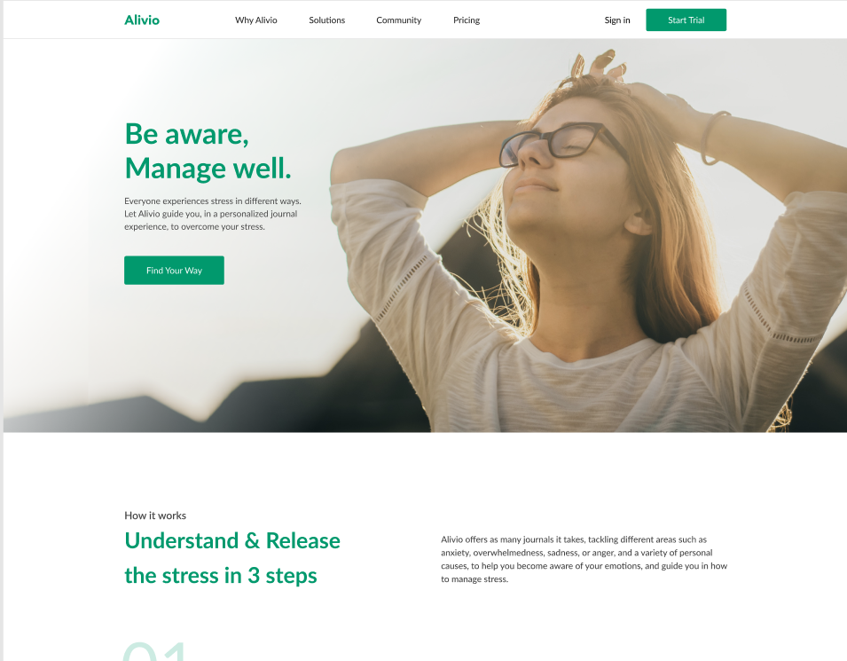

# Frontender[1.0]

Верстка второго макета по курсу [Frontender[1.0]](https://youtube.com/playlist?list=PLV9lBwGQ2FU1VOctyWifetyMMC-OTJ51e&si=eQ4OoAYHHS_QbM4v).

Используемые технологии:
- CSS/HTML
- flexbox
- БЕМ методология

